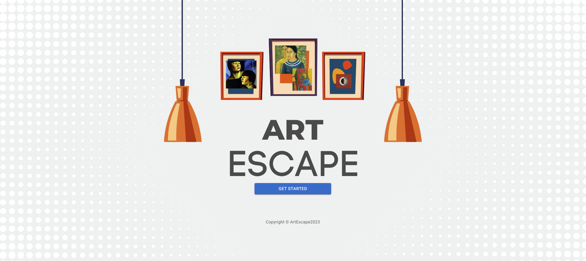
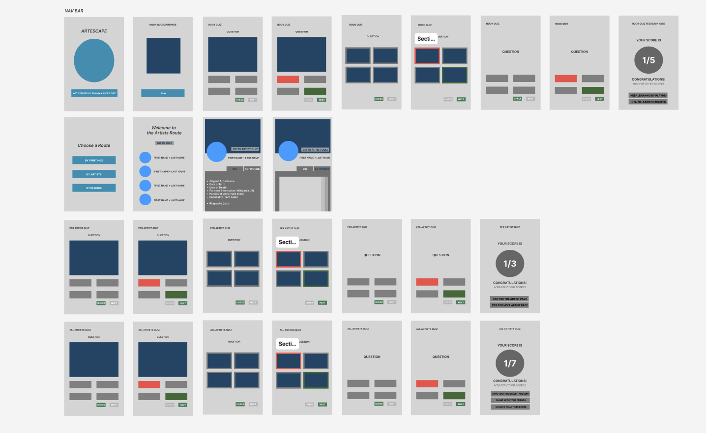
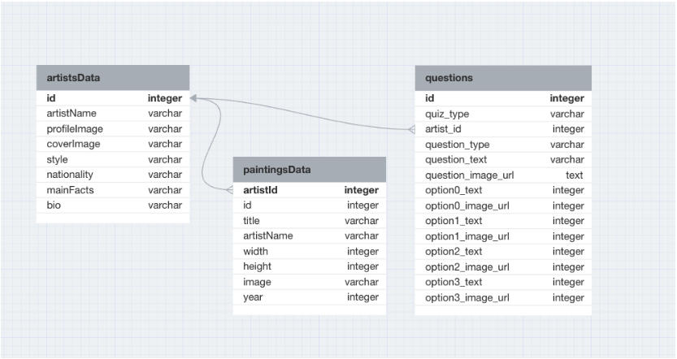
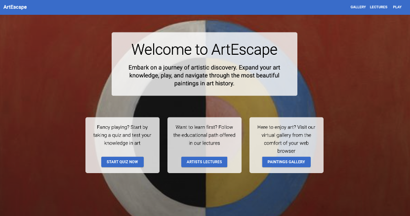
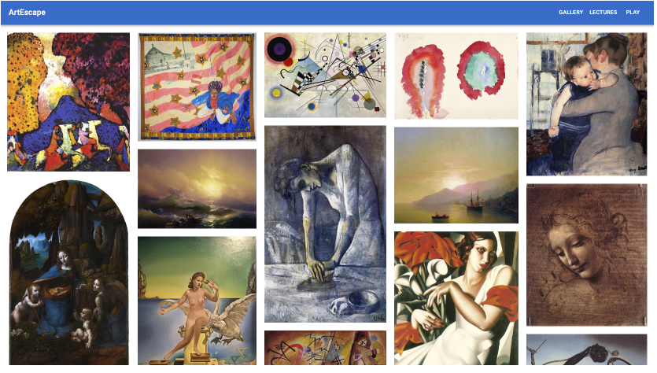
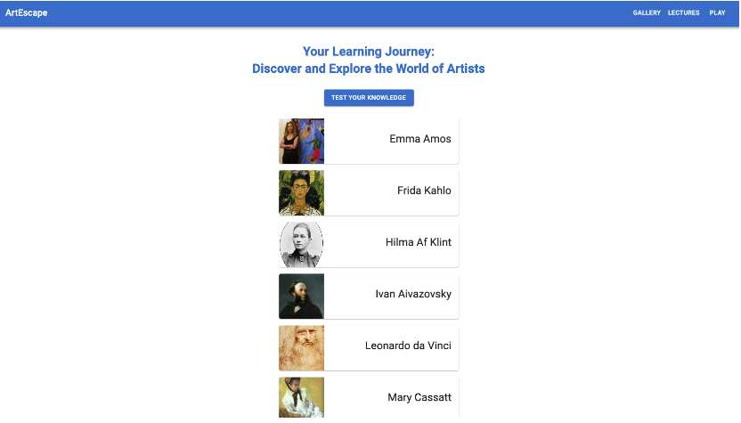
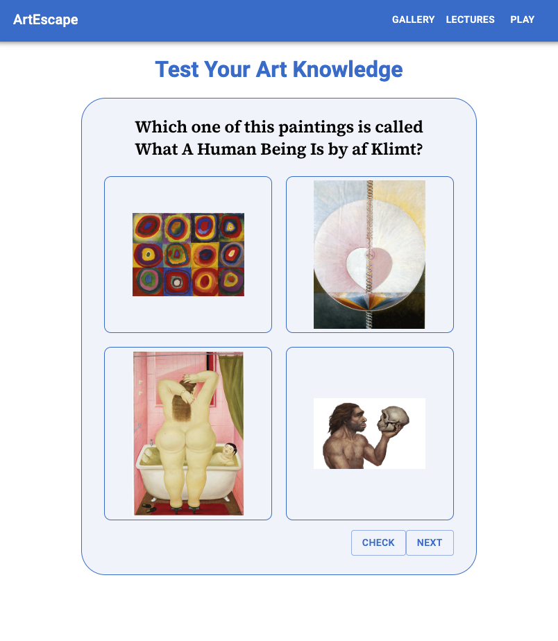

# ArtEscape App

ArtEscape is a web application designed to inspire and educate art enthusiasts of all levels. This full stack project is built in collaboration with an international team, offering a unique blend of interactive gameplay and immersive art lessons.

## About the project

The project is built with the following full stack development frameworks:

> **React** for the user interface;

> **Express** and **Node** for the server side;

> **MySQL** for the database.

## Client Side

- **Figma** as the the collaborative Interface Design Tool;
- **React Router** for the client side routing;
- **Material UI** as the React component library;
- **Vite** as a local development server for providing better performance for the web application.

## User Flow

Wireframing with Figma.
_A wireframe is a visual representation of what users will see and interact with when they land the app_

## Database

- **MySQL** as the Database Management System;
- **DB Designer** as the Database Schema Design and Modeling Tool.

## Database Schema

_3 Tables with Many-to-Many Relationship among them_

## Current features

Menu with possibilities of navigation to choose from.

Paintings Gallery - updated randomly

Lectures by artists to choose from

Artist page

Quiz

